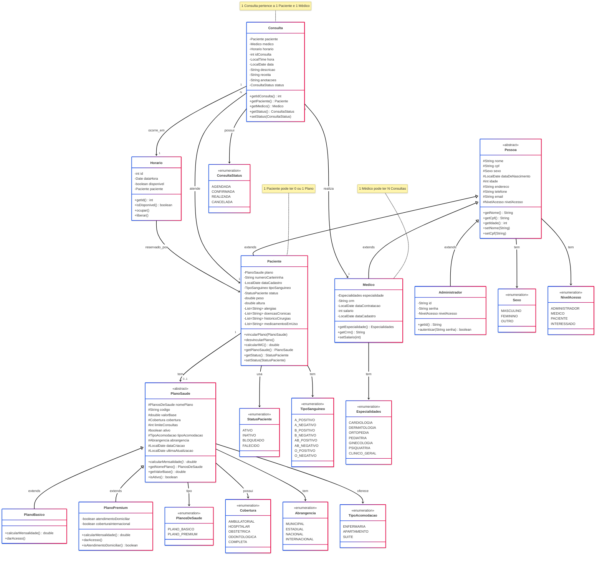
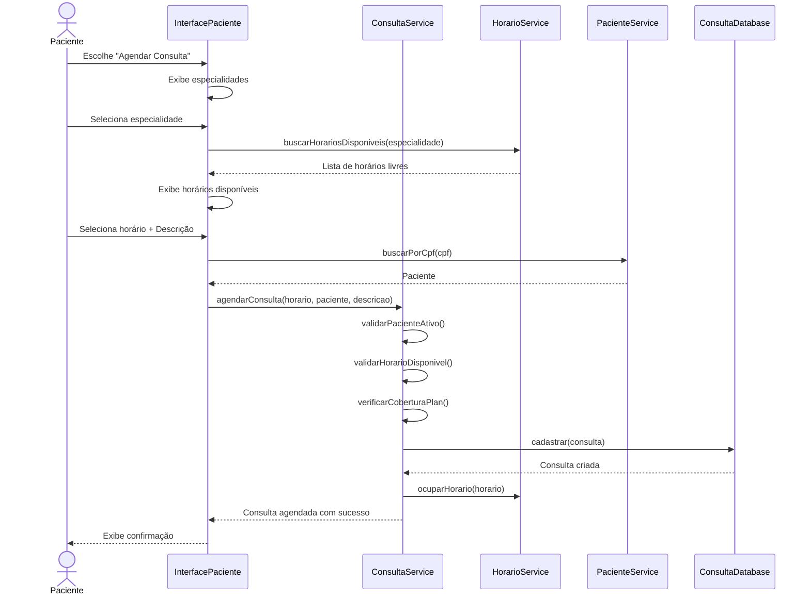

# 📊 Diagrama UML - Sistema de Plano de Saúde

## 🏗️ Diagrama de Classes Completo



---

## 📐 Diagrama de Relacionamentos Simplificado

```
                    Pessoa (abstract)
                    /      |      \
                   /       |       \
            Paciente    Medico   Administrador
                |          |
                |          |
            PlanoSaude  Horario
            /      \       |
           /        \      |
    PlanoBasico  PlanoPremium
                            |
                        Consulta
```

---

## 🔗 Relacionamentos Detalhados

### **Herança (Generalização)**
- `Pessoa` ← `Paciente` (é um)
- `Pessoa` ← `Medico` (é um)
- `Pessoa` ← `Administrador` (é um)
- `PlanoSaude` ← `PlanoBasico` (é um)
- `PlanoSaude` ← `PlanoPremium` (é um)

### **Composição/Agregação**
- `Paciente` → `PlanoSaude` (1:0..1) - Paciente **tem** plano
- `Consulta` → `Paciente` (N:1) - Consulta **atende** paciente
- `Consulta` → `Medico` (N:1) - Consulta **realizada por** médico
- `Consulta` → `Horario` (1:1) - Consulta **ocorre em** horário
- `Horario` → `Paciente` (1:0..1) - Horário **reservado por** paciente

### **Dependência (Uso)**
- `Paciente` usa `StatusPaciente` (enum)
- `Paciente` usa `TipoSanguineo` (enum)
- `Medico` usa `Especialidades` (enum)
- `Pessoa` usa `Sexo` (enum)
- `Pessoa` usa `NivelAcesso` (enum)
- `Consulta` usa `ConsultaStatus` (enum)
- `PlanoSaude` usa `Cobertura`, `Abrangencia`, `TipoAcomodacao` (enums)

---

## 📊 Cardinalidades

| Relacionamento | Cardinalidade | Descrição |
|----------------|---------------|-----------|
| Paciente → PlanoSaude | 1:0..1 | Um paciente pode ter zero ou um plano |
| Paciente → Consulta | 1:N | Um paciente pode ter várias consultas |
| Medico → Consulta | 1:N | Um médico pode realizar várias consultas |
| Medico → Horario | 1:N | Um médico pode ter vários horários |
| Consulta → Horario | N:1 | Várias consultas podem compartilhar referência a horários (histórico) |
| Horario → Paciente | 1:0..1 | Um horário pode ser reservado por zero ou um paciente |

---

## 🎨 Diagrama de Packages (Organização)

```
br.com.sistemaPlanoSaude
│
├── model
│   ├── pessoas
│   │   ├── Pessoa (abstract)
│   │   └── Paciente
│   │
│   ├── funcionarios
│   │   ├── Medico
│   │   └── Administrador
│   │
│   ├── planos
│   │   ├── PlanoSaude (abstract)
│   │   ├── PlanoBasico
│   │   └── PlanoPremium
│   │
│   ├── consulta
│   │   ├── Consulta
│   │   └── Horario
│   │
│   └── enums
│       ├── Sexo
│       ├── NivelAcesso
│       ├── StatusPaciente
│       ├── TipoSanguineo
│       ├── Especialidades
│       ├── PlanosDeSaude
│       ├── Cobertura
│       ├── Abrangencia
│       ├── TipoAcomodacao
│       └── ConsultaStatus
│
├── service
│   ├── PacienteService
│   ├── MedicoService
│   ├── ConsultaService
│   ├── HorarioService
│   ├── AgendaService
│   └── PlanoDeSaudeService
│
├── database
│   ├── PacienteDataBase
│   ├── FuncionariosDataBase
│   ├── ConsultaDatabase
│   ├── AgendaDataBase
│   └── LogDatabase
│
├── view
│   ├── menu
│   │   └── MenuPrincipal
│   │
│   ├── interfaces
│   │   ├── InterfaceAdministrador
│   │   ├── InterfaceMedico
│   │   ├── InterfacePaciente
│   │   └── InterfaceConsulta
│   │
│   ├── formularios
│   │   ├── FormularioPaciente
│   │   ├── FormularioMedico
│   │   ├── FormularioAdministrador
│   │   ├── FormularioPlanoDeSaude
│   │   └── FormularioAgendaMedico
│   │
│   ├── consulta
│   │   ├── GeracaoConsultaPaciente
│   │   ├── GeracaoConsultaMedico
│   │   └── GeracaoConsultaAdministrador
│   │
│   └── admin
│       ├── AdminPacienteView
│       ├── AdminMedicoView
│       └── AdminPlanoView
│
├── util
│   ├── ConsoleColors
│   ├── ValidacaoUtil
│   └── PacienteMockUtil
│
└── main
    └── Main
```

---

## 🔄 Diagrama de Sequência - Agendar Consulta



---

## 📈 Métricas do Sistema

| Métrica | Valor |
|---------|-------|
| Total de Classes | 29 |
| Classes Abstratas | 2 (Pessoa, PlanoSaude) |
| Classes Concretas | 17 |
| Enums | 10 |
| Interfaces | 0 |
| Herança (profundidade máxima) | 2 níveis |
| Relacionamentos | 25+ |

---

## 🏛️ Padrões de Design Aplicados

### **1. Template Method**
- `PlanoSaude.calcularMensalidade()` - Método abstrato implementado por subclasses

### **2. Strategy**
- Diferentes estratégias de cálculo de mensalidade (PlanoBasico vs PlanoPremium)

### **3. Inheritance (Herança)**
- Hierarquia `Pessoa` → `Paciente/Medico/Administrador`
- Hierarquia `PlanoSaude` → `PlanoBasico/PlanoPremium`

### **4. Repository**
- Classes Database atuam como repositories (PacienteDataBase, etc)

### **5. Service Layer**
- Camada de serviços isolando lógica de negócio (PacienteService, etc)

### **6. Enum Pattern**
- Uso extensivo de enums para valores fixos (StatusPaciente, Especialidades, etc)

---

**Gerado em:** 25/11/2025  
**Versão:** 1.0.0  
**Sistema:** Gerenciador de Plano de Saúde
